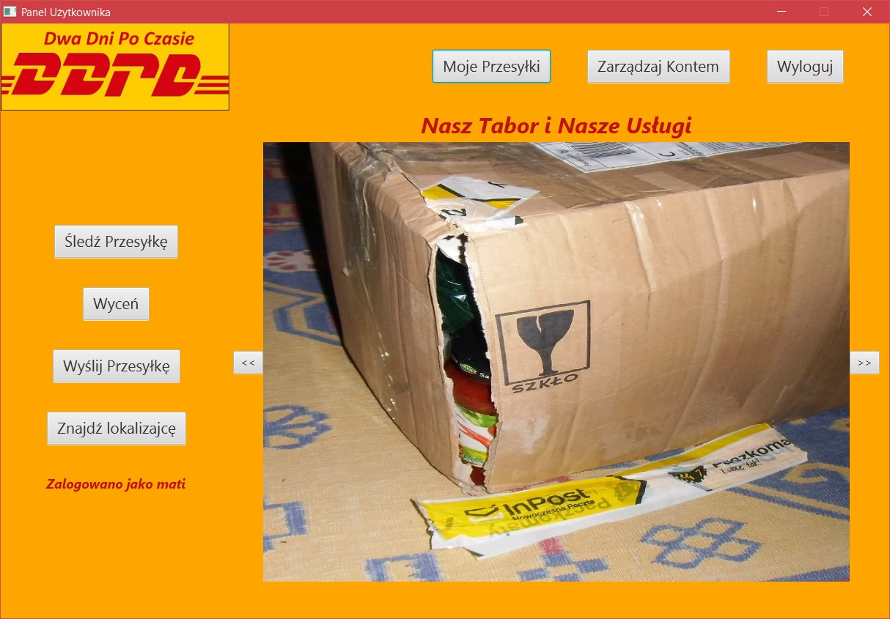
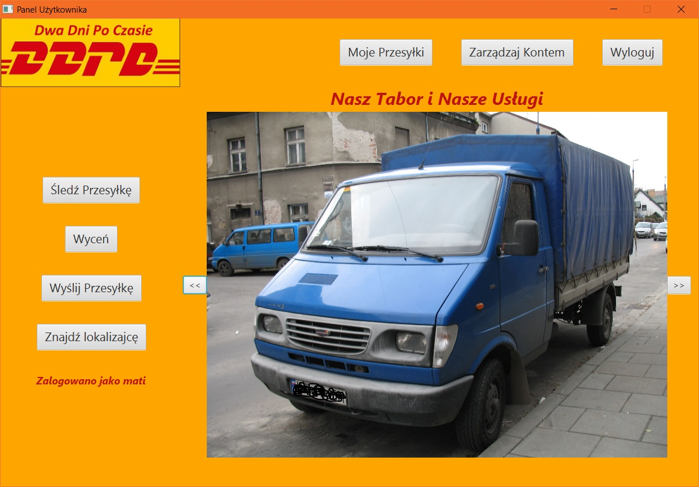
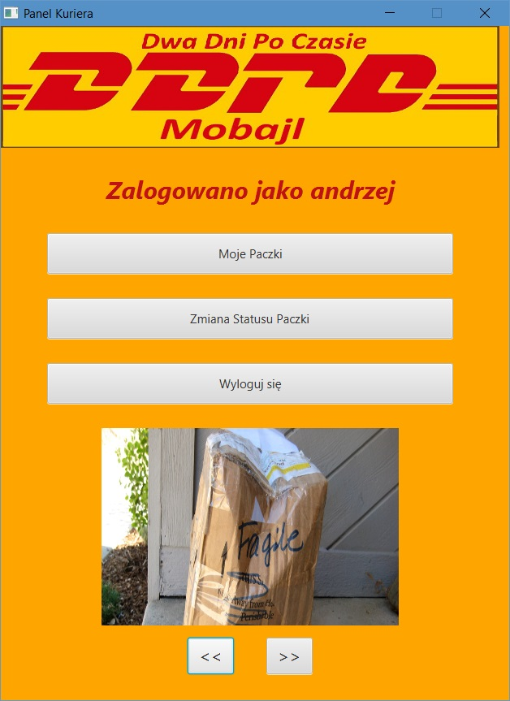

# TransportCompanySystem
# [PL]
Prosty system do obsługi firmy kurierskiej. Projekt oparty jest na architekturze Klient-Serwer. Aplikacja została napisana przy użyciu języka Java i biblioteki graficznej JavaFX. Do przechowywania danych została użyta baza danych Oracle.
W systemie można zarejestrować konto użytkownika i dokonywać operacji na swoim koncie, wysyłać przesyłki oraz sprawdzać poszczególne dane dostępne w systemie.
Dodatkowo system posiada obsługę konta kuriera do dokonywania zmian na statusach paczki oraz konta administratora. Domyślne konto admina to login i hasło: admin.
Do poprawnego działania należy załadować dane do bazy dancyh z pliku: "Server/src/main/java/pl/TransportCompanySystem/Server/resources/dataBase.sql"

# [EN]
A simple system to operate a courier company. The project is based on the Client-Server architecture. The application was written using Java and the JavaFX graphic library. The Oracle database was used for data storage.
In the system, you can register a user account and perform operations on your account, send parcels and check individual data available in the system.
In addition, the system has courier account support for making changes to the status of the package and administrator account. The default admin account is the login and password: admin.
For proper operation, you should load the data into the database from the file: "Server / src / main / java / en / TransportCompanySystem / Server / resources / dataBase.sql"

## Screens

 
*Okno servera*
 
*Server window*

 
*Okno servera po kilku operacjach i wyłączeniu. Logi zostają zapisane w pliku*
 
*Server window after several operations and switching off. The logs are saved in the file*

 
*Okno startowe aplikacji*
 
*Application startup window*

 
*Okno rejestracji nowego użytkownika*
 
*New user registration window*

 
*Okno panelu logowania*
 
*Login panel window*

 
*Okno po zalogowaniu się na konto użytkownika*
 
*Window after logging in to the user's account*

 
*Okno po zalogowaniu się na konto użytkownika. Przesuwana galeria zdjęć*
 
*Window after logging in to the user's account. Slide photo gallery*

 
*Okno po zalogowaniu się na konto użytkownika. Przesuwana galeria zdjęć*
 
*Window after logging in to the user's account. Slide photo gallery*

 
*Okno edycji danych użytkownika*
 
*User data editing window*

 
*Okno śledzenia paczek*
 
*Parcel tracking window*

 
*Okno dostępnych lokalizacji dostępne spod panelu użytkownika*
 
*The window of available locations available from the user's panel*

 
*Okno wyceny paczek*
 
*Parcel valuation window*

 
*Okno nadawania nowej paczki*
 
*Window for sending a new package*

 
*Okno paczek użytkownika*
 
*User's packs window*

 
*Okno szczegółów paczki użytkownika*
 
*The user's package details window*

 
*Okno panelu administratora*
 
*Administrator panel window*

 
*Okno użytkowników w systemie z panelu administratora*
 
*Users' window in the system from the admin panel*

 
*Okno szczegółów użytkownika z panelu administratora*
 
*User details window from the admin panel*

 
*Okno administratorów w systemie z panelu administratora*
 
*Administrators window in the system from the admin panel*

 
*Okno samochodów w systemie z panelu administratora*
 
*Cars in the system from the admin panel*

 
*Okno pracowników w systemie z panelu administratora*
 
*Employees' window in the system from the admin panel*

 
*Okno szczegółów dotyczących pracownika w systemie z panelu administratora*
 
*Details window about the employee in the system from the admin panel*

 
*Okno edycji danych pracownika w systemie z panelu administratora*
 
*Window for editing employee data in the system from the admin panel*

 
*Okno paczek kuriera z panelu administratora*
 
*Window of courier parcels from the admin panel*

 
*Okno dostępnych lokalizacji z panelu administratora*
 
*The window of available locations from the admin panel*

 
*Okno paczek w wybranej lokalizacji z panelu administratora*
 
*The window of packages in the selected location from the admin panel*

 
*Okno paczek z panelu administratora*
 
*Parcel window from the admin panel*

 
*Okno szczegółów paczki z panelu administratora*
 
*Parcel details window from the admin panel*

 
*Okno edycji paczki z panelu administratora*
 
*Window for editing the package from the admin panel*

 
*Okno panelu głównego po zalogowaniu się na konto kuriera*
 
*The main panel window after logging into the account of the courier*

 
*Okno panelu głównego po zalogowaniu się na konto kuriera. Przesuwana galeria zdjęć*
 
*The main panel window after logging into the account of the courier. Slide photo gallery*

 
*Okno paczek kuriera, wyświetlane z panelu kuriera*
 
*Window of courier parcels, displayed from the courier panel*

 
*Okno edycji paczki, wyświetlane z poziomu panelu kuriera. W ten sposób można dostarczyć paczkę. Odbiorca podpisuje się w tym miejscu. Dane te będą potem dostępne w śledzeniu paczki. Będzie widoczne kto odebrał daną paczkę*
 
*The package editing window, displayed from the courier panel. In this way, a package can be delivered. The recipient signs in this place. These data will then be available in the package tracking. It will be visible who picked up the package*

 
*Okno szczegółów paczki użytkownika z panelu użytkownika po odebraniu paczki. Podpis widnieje w statusie paczki*
 
*The user's package details window from the user's panel after receiving the package. The signature appears in the status of the package*
